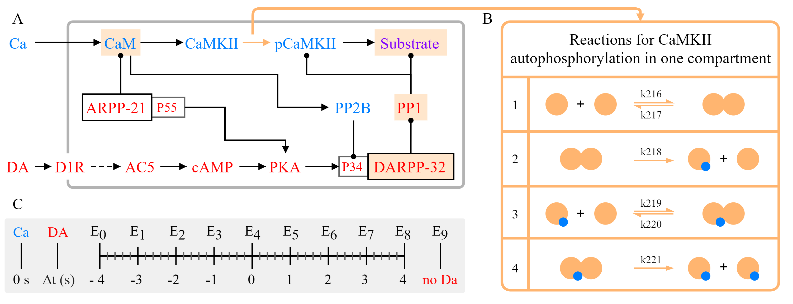

Nair et al. 2016
================

We illustrate the Subcellular Workflow with a model depicting the emergence of the eligibility trace observed in reinforcement learning in striatal D1 medium spiny neurons (D1 MSN) (Nair et al. 2016). Here, an intracellular increase in calcium representing excitatory synaptic input leads to synaptic potentiation only when it is followed by a reinforcing dopamine input. These two signaling cascades, starting with a calcium train and a dopamine transient, are illustrated in Fig. 1a. The first pathway (depicted in blue) represents calcium-dependent activation of Ca2+/calmodulin-dependent protein kinase II (CaMKII), its autophophorylation, and the phosphorylation of a generic CaMKII substrate that represents long term potentiation (LTP). In the second pathway (species in red), dopamine initiates a G-protein dependent cascade which results in the phosphorylation of dopamine- and cAMP-regulated phosphoprotein, 32 kDa (DARPP-32) turning into an inhibitor of protein phosphatase 1 (PP1) that otherwise dephosphorylates CaMKII and its substrate. Substrate phosphorylation is maximal when the time window between the calcium and dopamine inputs is sufficiently short (input-interval constraint mediated by DARPP-32 via PP1 inhibition), and when intracellular calcium elevation is followed by dopamine (input-order constraint mediated by another phosphoprotein, the cyclic AMP-regulated phosphoprotein, 21 kDa (ARPP-21) that sequesters calcium/calmodulin if dopamine arrives before calcium).

CaMKII is autophosphorylated both in the cytosol and the post synaptic density (PSD) with a custom MATLAB rate function as described in Li et al. (2012). To run the model in different software, we substitute the autophosphorylation rate function with the same set of bimolecular reactions (simplified version of reactions from Pepke et al. 2010) for both compartments. The reactions represent the formation of a complex with two fully activated CaMKII monomers and a catalytic step in which one monomer phosphorylates the other. Schematics can be found in Fig. 1b along with the six new parameters. We estimated the parameters using simulated data from the published model with simulation setups in Fig. 1c depicting different timings of the dopamine input relative to the calcium input.

Figure 1. (A) Simplified schematics of the model. Species in the calcium cascade are depicted in blue, and species in the dopamine cascade are depicted red. Simulated time course data of the species with a beige background were used in parameter estimation. Figure adapted from Nair et al. (2016). (B) Illustration of the bimolecular reactions in CaMKII autophosphorylation with yellow circles representing activated CaMKII, and blue circles representing phosphate groups. Newly introduced parameters with their IDs in the updated model are shown above/below the arrows. (C) Timing of the dopamine input (Δt ={-4,-3,-2,-1,0,1,2,3,4} corresponding to experiments E0-E8) relative to calcium increase (time 0), and a single experiment without dopamine (E9).

.. raw:: html

   <h2>Reactions chosen for parameter estimation and Global Sensitivity Analysis</h2>

Four reactions representing autophosphorylation in one compartment. 

Reactions in cytosol:

  * CaMKII_CaM_Ca4 + CaMKII_CaM_Ca4 <=> CaMKII_CaM_Ca4_CaMKII_CaM_Ca4
  * CaMKII_CaM_Ca4_CaMKII_CaM_Ca4 -> pCaMKII_CaM_Ca4 + CaMKII_CaM_Ca4
  * pCaMKII_CaM_Ca4 + CaMKII_CaM_Ca4 <=> pCaMKII_CaM_Ca4_CaMKII_CaM_Ca4
  * pCaMKII_CaM_Ca4_CaMKII_CaM_Ca4 -> pCaMKII_CaM_Ca4 + pCaMKII_CaM_Ca4

Reactions in PSD:

  * CaMKII_CaM_Ca4_psd + CaMKII_CaM_Ca4_psd <=> CaMKII_CaM_Ca4_psd_CaMKII_CaM_Ca4_psd
  * CaMKII_CaM_Ca4_psd_CaMKII_CaM_Ca4_psd -> pCaMKII_CaM_Ca4_psd + CaMKII_CaM_Ca4_psd
  * pCaMKII_CaM_Ca4_psd + CaMKII_CaM_Ca4_psd <=> pCaMKII_CaM_Ca4_psd_CaMKII_CaM_Ca4_psd
  * pCaMKII_CaM_Ca4_psd_CaMKII_CaM_Ca4_psd -> pCaMKII_CaM_Ca4_psd + pCaMKII_CaM_Ca4_psd

.. raw:: html

   <h2>Model Repository</h2>
   
`https://github.com/jpgsantos/Model_Nair_2016 <https://github.com/jpgsantos/Model_Nair_2016>`_

.. raw:: html

   <h2>References</h2>

`Li, L., Stefan, M.I.,. Le Novere, N. (2012). Calcium input frequency, duration and amplitude differentially modulate the relative activation of
calcineurin and CaMKII. PLoS One, 7:e43810. <https://doi.org/10.1371/journal.pone.0043810>`_

`Nair, A.G., Bhalla, U.S., Kotaleski J.H. (2016). Role of DARPP-32 and ARPP-21 in the emergence of temporal constraints on striatal Calcium 
and Dopamine integration. PLoS Computational Biology, 1;12(9):e1005080. doi: 10.1371/journal.pcbi.1005080. <https://doi.org/10.1371/journal.pcbi.1005080>`_

`Pepke, S., Kinzer-Ursem, T., Mihalas, S., Kennedy, M.B. (2010). A dynamic model of interactions of Ca2+, calmodulin, and catalytic subunits
of Ca2+/calmodulin-dependent protein kinase II. PLoS Computational Biology, 12;6(2):e1000675. <https://dx.doi.org/10.1371%2Fjournal.pcbi.1000675>`_