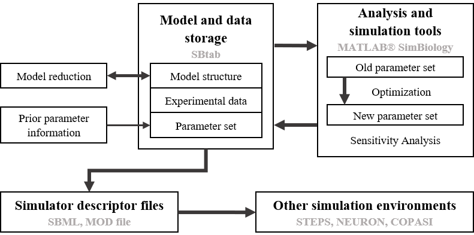

.. Subcelular workflow documentation master file, created by
   sphinx-quickstart on Fri Nov 22 15:04:59 2019.
   You can adapt this file completely to your liking, but it should at least
   contain the root `toctree` directive.

Welcome to the Subcelular workflow documentation!
=================================================

|

Subcelular workflow is a software for developing biochemical pathway models using the MATLAB SimBiology toolbox,
it can be used for model optimization, global sensitivity analysis.

|

|

Here you can find a modified version of the D1 MSN subcellular cascade model from Nair et al 2016.

SBtab
-----

The model along with the simulated data (sheets E0-E8) used for optimization of the CaMKII autophosphorylation 
module (reactions 128-135) is found in the SBtab format D1_LTP_time_window_SBtab.xlsx. Inputs to all datasets 
are also represented in the sheet following each dataset (E0I-E8I).

tsv
---

tsv files generated from each SBtab sheet are available in the zipped file D1_LTP_time_window.tar.gz

MATLAB
------

The steady-state model in MATLAB SimBiology format can be found in the MATLAB folder. In addition, there are 
input scripts (spike.m, spiketraindd_Ca.m, spiketraindd_DA.m) that generate the input curves used in model 
simulations. These are used by the script Regenerate_figures.m that can be run directly and will produce two 
figures from the original paper, validating the updated model.

SBML
----

The model in SBML format is called D1_LTP_time_window_SBML.xml

VFGEN/MOD
---------

The folder "SBtab to VFGEN/MOD Conversion Tools" contains the main script sbtab_to_vfgen.R that converts the model
in SBtab into a VFGEN (D1_LTP_time_window_VFgen.vf) and a MOD file (D1_LTP_time_window_MOD.mod) that can be run 
in NEURON. Additional instruction can be found in the README.

R
-

The folder R contains the model in R format D1_LTP_time_window.R.

.. toctree::
   :maxdepth: 2

   Matlab 

.. toctree::
   :maxdepth: 2

   SBtab_vfgen_convertion_tool
   
.. toctree::
   :maxdepth: 2

   Neuron
   
.. toctree::
   :maxdepth: 2

   Sub_application

.. toctree::
   :maxdepth: 2
   
   SBML_fix