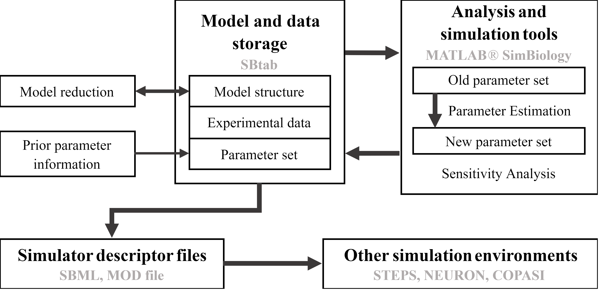

Welcome to the Subcelular workflow documentation! (*Under construction*)
========================================================================

|

This workflow has been developed to tackle the challenge of building and analyzing biochemical pathway models, combining pre-existing tools and custom-made software.

At the root of our implementation is the SBtab format, a file that can store biochemical models and associated data in an easily readable and expandable way.

We have also developed tools to convert the SBtab format into several formats that can be used in MATLAB, Neuron, STEPS and Copasi.

Using MATLAB we have developed custom scripts for parameter estimation, global sensitivities analysis, and diagnostics tools that can be used for model development.

We demonstrate all these features using an example model, a modifieed version of the D1 MSN subcellular cascade model from Nair et al 2016 [1]_.

Code to run this model in MATLAB, Neuron, and Subcellular aplication(STEPS) can be found on the "MATLAB", "Neuron" and "Bionetgen and Steps folders" respectively.

|

Features:

* Model simulation, using MATLAB, subcellular aplication(STEPS), or Neuron
* Analysis of selected parameter sets, using MATLAB
* Parameter optimization, using MATLAB
* Global Sensitivity analysis, using MATLAB
* Conversion tools:

  * SBtab(.xlsx) to SBtab(.tsv), using MATLAB
  * SBtab(.xlsx) to MATLAB SimBiology(.m, .sbproj), using MATLAB
  * MATLAB SimBiology to SBML(.xml), using MATLAB
  * SBtab(.tsv) to VFGEN(.vf), using R
  * SBtab(.tsv) to Mod(.mod), using R
  * SBtab(.tsv) to SBML(.xml), using R

|

|

.. toctree::
   :hidden:
   :maxdepth: 1

   SBtab 
   Matlab
   Neuron
   Sub_application
   Conversion_tools
   Model

References
----------

.. [1] Nair, A.G., Bhalla, U.S., Kotaleski J.H. (2016). Role of DARPP-32 and ARPP-21 in the emergence of temporal constraints on striatal Calcium and Dopamine integration. PLoS Computational Biology, 1;12(9):e1005080.